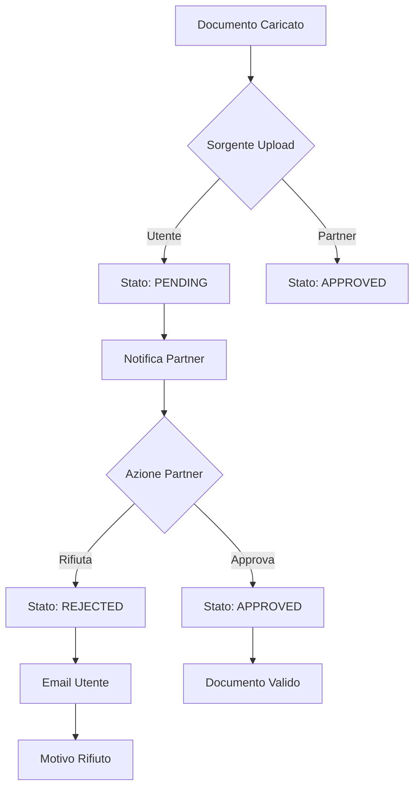

# CLAUDE.md - Piattaforma Diamante

## 📋 STATO ATTUALE - SISTEMA STABILE

### ✅ **RESET COMPLETATO** 
**Data**: 5 Agosto 2025  
**Commit**: `0b06472` - Add comprehensive error handling to UserDashboard API calls  
**Stato**: Sistema ripristinato al funzionamento stabile precedente

### 🚨 PROBLEMI CRITICI DA RISOLVERE

### 🔴 **1. AUTENTICAZIONE - Sistema Rotto** (PRIORITÀ #1)
**Problemi**:
- ⬜ Login non funziona dopo registrazione/iscrizione
- ⬜ Utente stefanojpriolo@gmail.com bloccato nel sistema
- ⬜ Sistema accesso form iscrizione non sicuro (email nell'URL)
**Azioni**: Fix autenticazione e implementazione sistema sicuro post-verifica

### 🔴 **2. SESSIONE - Perdita Dati Form** (PRIORITÀ #2)
**Problemi**:
- ⬜ Dati form iscrizione non persistono in sessione
- ⬜ Refresh pagina fa perdere tutte le modifiche
- ⬜ Form multi-step non mantiene stato
**Azioni**: Implementare persistenza sessione/localStorage

### 🔴 **3. SICUREZZA - Falla Accesso Dati** (PRIORITÀ #3)
**Problemi**:
- ⬜ Email nell'URL permette accesso a dati altrui
- ⬜ URL tipo: `?emailVerified=true&email=stefanojpriolo%40gmail.com`
- ⬜ Basta modificare email per accedere ad altri utenti
**Azioni**: Sostituire con sistema token/codice sicuro

### 🔴 **4. CONTRATTI - Sistema Non Funzionante** (PRIORITÀ #4)
**Problemi**:
- ⬜ Anteprima contratto precompilato non funziona
- ⬜ Download contratto precompilato non funziona  
- ⬜ Upload contratto firmato non funziona
**Azioni**: Debug completo sistema contratti con verifica API endpoints

### 🔴 **5. DOCUMENTI - Sistema Unificato Multi-Sorgente** (PRIORITÀ #5)
**Problemi**:
- ⬜ Documenti caricati in iscrizione non visibili in "I miei documenti"
- ⬜ Errore caricamento documenti da area riservata
- ⬜ Validazione formato file mostra messaggio generico
- ⬜ Manca sistema approvazione/rifiuto documenti
- ⬜ Nessuna anteprima documenti lato utente
**Soluzione**: Implementare sistema documenti unificato con approvazione partner

---

## 📂 SISTEMA DOCUMENTI UNIFICATO - SPECIFICA TECNICA

### 🏗️ **Architettura Multi-Sorgente**

Il sistema documenti deve supportare caricamento da 3 sorgenti diverse con sincronizzazione real-time:

#### 📤 **1. Upload durante Iscrizione** (Form Multi-Step)
- **Percorso**: `/enrollment` → Step Documenti
- **Storage**: File salvati in `uploads/registrations/{registrationId}/`
- **Database**: Creazione record in `UserDocument` con `registrationId`
- **Stato iniziale**: `PENDING` - in attesa di verifica partner

#### 👤 **2. Upload da Area Personale Utente**
- **Percorso**: `/dashboard` → "I miei documenti"
- **Storage**: File salvati in `uploads/users/{userId}/`  
- **Database**: Creazione/aggiornamento record in `UserDocument`
- **Notifica**: WebSocket/polling per notificare partner nuovo documento

#### 🏢 **3. Upload da Pannello Partner**
- **Percorso**: `/partner/registrations/{id}` → Gestione Documenti
- **Storage**: File salvati in `uploads/registrations/{registrationId}/partner/`
- **Database**: Creazione record con flag `uploadedByPartner: true`
- **Visibilità**: Solo documenti utente, non quelli partner (CNRed, Adverintia)

### 🔄 **Flusso Approvazione Documenti**



### 📧 **Sistema Notifiche Email**

#### Template Email Rifiuto Documento:
```html
Oggetto: Documento non conforme - Azione richiesta

Gentile {userName},

Il documento "{documentType}" caricato il {uploadDate} non è conforme.

Motivo del rifiuto: {rejectionReason}

Per procedere con la sua iscrizione, la preghiamo di:
1. Accedere alla sua area personale
2. Caricare nuovamente il documento corretto
3. Attendere la verifica del partner

Link area personale: {dashboardUrl}

Cordiali saluti,
Team Diamante
```

### 🖼️ **Sistema Anteprima Documenti**

#### Componente DocumentPreview:
- **PDF**: Viewer integrato con react-pdf
- **Immagini**: Modal con zoom e navigazione
- **Altri formati**: Download diretto con icona tipo file
- **Sicurezza**: URL firmati con scadenza temporale

---

## 🎯 ARCHITETTURA SISTEMA

### ✅ FLUSSO REGISTRAZIONE E ISCRIZIONE - FUNZIONANTE

**IMPORTANTE**: Il sistema separa completamente la registrazione utente (creazione profilo) dall'iscrizione ai corsi.

#### ✅ **Registrazione Utente** - Funzionante
- Partner invia link referral → popup registrazione → form dati completi
- Sistema crea profilo con partner permanente + email verifica  
- Post-verifica: redirect con email per caricamento dati sicuro
- Form iscrizione pre-popolato con dati utente esistenti

#### ✅ **Iscrizione Corso** - Funzionante con Miglioramenti Necessari
- Utenti autenticati o verificati via email accedono al form
- Form TFA completo con tutti i campi necessari
- Sistema multi-step con validazione per step
- Riepilogo finale con tutti i dati dell'utente

##### 📝 **Form Iscrizione TFA - Miglioramenti Richiesti**:
- ⬜ **Blocco Diploma**: Aggiungere sezione con campi (data conseguimento*, città*, provincia*, istituto*, voto*)
- ⬜ **Select Università/Corsi**: Trasformare in select con filtro testuale per ricerca
- ⬜ **Fix Laurea Magistrale**: Se seleziono "laurea magistrale", rimuovere scelta "tipo laurea triennale" nel blocco triennale
- ⬜ **Campi Voto**: Aggiungere voto laurea magistrale e triennale (non obbligatori)
- ⬜ **Vecchio Ordinamento**: Aggiungere corsi mancanti del vecchio ordinamento in "corso di laurea conseguito"
- ⬜ **Piano Personalizzato**: Non mostrare piano rate dopo selezione piano personalizzato (già visibile in area riservata)

#### ✅ **Sistema Multi-Offerta** - Implementato
- **TFA Romania**: Form completo + pagamenti fissi/personalizzati
- **Certificazioni**: Form ridotto + solo pagamenti personalizzati
- Partner configura offerte con piani rate flessibili

---

## 🎨 PANNELLO PARTNER - AGGIORNAMENTI NECESSARI

### 📊 **Dashboard Partner**

#### 🔄 **Iscrizioni Recenti** - COMPLETATO
- ✅ **Sezione rinominata**: Da "Attività recenti" a "Iscrizioni recenti"
- ✅ **Info corso aggiunta**: Mostra il corso relativo all'iscrizione
- ✅ **Card cliccabili**: Click su card → dettaglio utente completo
- ✅ **Link "Vedi tutto"**: Porta alla gestione utenti completa

### 👥 **Gestione Utenti - Da Aggiornare**

#### 📄 **Pagina Dettaglio Iscrizione** - MODIFICHE NECESSARIE

##### 🔧 **Workflow Stati TFA - Da Modificare**
- ⬜ **Primo step**: Rinominare da "Iscrizione completata" a "Iscrizione eseguita"
- ⬜ **Piano pagamento**: Aggiungere scadenze rate visibili con date calcolate
- ⬜ **Rimuovere**: Blocco sincronizzazione (non necessario)

##### 🎓 **Workflow Certificazioni - Da Implementare**
Stati specifici per template Certificazioni (diversi da TFA):
1. ⬜ Iscrizione completata
2. ⬜ Pagamento completato  
3. ⬜ Iscritto all'esame (operatore inserisce manualmente data esame)

##### 📑 **Sistema Contratti** - DA RIPARARE (PRIORITÀ)
**Problemi identificati**:
- ⬜ **Anteprima contratto precompilato**: Non funziona
- ⬜ **Download contratto precompilato**: Non funziona
- ⬜ **Upload contratto firmato**: Non funziona
- ⬜ Verificare API endpoints e permessi

##### 📄 **Gestione Documenti Partner** - NUOVO
- ⬜ **CNRed**: Partner può caricare, non visibile a utente direttamente
- ⬜ **Adverintia**: Partner può caricare, non visibile a utente direttamente
- ⬜ **Card notifica**: Card colorata quando documenti CNRed/Adverintia sono caricati
- ⬜ **Verifica documenti**: Partner approva/rifiuta documenti utente
- ⬜ **Email notifica**: Invio automatico se documento rifiutato

---

## 🧑‍💼 AREA RISERVATA UTENTE - MODIFICHE

### 📁 **Gestione Documenti** - Da Fixare
- ⬜ **Sincronizzazione**: Mostrare documenti caricati in iscrizione
- ⬜ **Fix upload**: Risolvere errore caricamento documenti
- ⬜ **Validazione Migliorata**: Messaggio specifico "Il file è di un formato non supportato" per file non validi
- ⬜ **Stati documento**: Pending/Approvato/Rifiutato dal partner con indicatori visivi
- ⬜ **Anteprima Documenti**: Aggiungere possibilità di vedere anteprima documenti (come pannello partner)
- ⬜ **Download Documenti**: Permettere download oltre alla sola visualizzazione

### 📄 **Documenti Partner Speciali** - NUOVO
- ⬜ **CNRed/Adverintia**: Partner può caricare questi documenti per ogni iscrizione
- ⬜ **Visibilità Utente**: Documenti non direttamente visibili, solo card colorata quando caricati
- ⬜ **Card Notifica**: Card che cambia colore per avvisare presenza documenti partner

### 💳 **Piano Pagamenti** - Da Aggiornare
- ⬜ **Scadenze dinamiche corrette**: 
  - Acconto: 7 giorni da iscrizione
  - Prima rata: 30 giorni dopo scadenza acconto (non dalla data iscrizione)
  - Rate successive: sempre al 30 del mese
- ⬜ Non mostrare piano rate dopo selezione piano personalizzato

---

## 📊 Database Schema Aggiornamenti Necessari

```prisma
// Modifiche al modello Registration
model Registration {
  // ... campi esistenti ...
  
  // Sicurezza accesso
  verificationCode        String?   @unique // Codice univoco post-verifica
  codeExpiresAt          DateTime? // Scadenza codice
  
  // Contratti
  contractTemplateUrl     String?   
  contractSignedUrl       String?   
  contractGeneratedAt     DateTime? 
  contractUploadedAt      DateTime? 
  
  // Documenti partner (non visibili a utente)
  cnredUrl               String?
  cnredUploadedAt        DateTime?
  adverintiaUrl          String?
  adverintiaUploadedAt   DateTime?
  
  // Stati workflow estesi
  status                  RegistrationStatus @default(PENDING)
  statusHistory           StatusChange[]
  
  // Certificazioni - data esame
  examDate               DateTime? // Per workflow certificazioni
  examRegisteredBy       String?   // Partner che registra data
  
  // Relazione con documenti
  documents              UserDocument[]
  
  // ... relazioni esistenti ...
}

// Modello UserDocument Completo - Sistema Unificato
model UserDocument {
  id                String   @id @default(uuid())
  userId            String
  registrationId    String?
  
  // Tipo e contenuto documento
  type              DocumentType  // Enum per tipo documento
  originalName      String        // Nome file originale
  mimeType          String        // MIME type per anteprima
  size              Int           // Dimensione in bytes
  url               String        // Path storage locale
  signedUrl         String?       // URL firmato temporaneo per download
  
  // Gestione approvazione
  status            DocumentStatus @default(PENDING)
  verifiedBy        String?       // ID partner che verifica
  verifiedAt        DateTime?
  rejectionReason   String?       // Motivo specifico rifiuto
  rejectionDetails  String?       // Note aggiuntive per utente
  
  // Tracking sorgente upload
  uploadSource      UploadSource  // ENROLLMENT, USER_DASHBOARD, PARTNER_PANEL
  uploadedBy        String        // ID utente o partner che carica
  uploadedByRole    UserRole      // USER, PARTNER, ADMIN
  uploadedAt        DateTime @default(now())
  
  // Metadati sicurezza
  checksum          String?       // Hash SHA-256 per integrità
  encryptionKey     String?       // Per documenti sensibili
  expiresAt         DateTime?     // Scadenza documento temporaneo
  
  // Notifiche
  partnerNotifiedAt DateTime?     // Quando partner è stato notificato
  userNotifiedAt    DateTime?     // Quando utente è stato notificato (per rifiuti)
  emailSentAt       DateTime?     // Timestamp invio email
  
  // Relazioni
  user              User @relation(fields: [userId], references: [id], onDelete: CASCADE)
  registration      Registration? @relation(fields: [registrationId], references: [id], onDelete: CASCADE)
  verifier          User? @relation("DocumentVerifier", fields: [verifiedBy], references: [id])
  uploader          User @relation("DocumentUploader", fields: [uploadedBy], references: [id])
  
  // Indici per performance
  @@index([userId, status])
  @@index([registrationId, type])
  @@index([status, partnerNotifiedAt])
  @@index([uploadedAt])
}

// Enum per tipi documento
enum DocumentType {
  IDENTITY_CARD        // Carta identità
  PASSPORT            // Passaporto
  DIPLOMA             // Diploma superiori
  BACHELOR_DEGREE     // Laurea triennale
  MASTER_DEGREE       // Laurea magistrale
  TRANSCRIPT          // Transcript voti
  CV                  // Curriculum
  PHOTO               // Foto tessera
  RESIDENCE_CERT      // Certificato residenza
  BIRTH_CERT          // Certificato nascita
  CONTRACT_SIGNED     // Contratto firmato
  OTHER               // Altri documenti
}

enum DocumentStatus {
  PENDING    // In attesa di verifica
  APPROVED   // Approvato dal partner
  REJECTED   // Rifiutato con motivazione
  EXPIRED    // Scaduto (per doc temporanei)
}

enum UploadSource {
  ENROLLMENT       // Durante iscrizione
  USER_DASHBOARD   // Da area personale
  PARTNER_PANEL    // Da pannello partner
}

// Modello per log azioni documenti
model DocumentActionLog {
  id            String   @id @default(uuid())
  documentId    String
  action        String   // UPLOAD, APPROVE, REJECT, DELETE, VIEW, DOWNLOAD
  performedBy   String
  performedRole UserRole
  details       Json?    // Dettagli aggiuntivi azione
  ipAddress     String?
  userAgent     String?
  timestamp     DateTime @default(now())
  
  document      UserDocument @relation(fields: [documentId], references: [id], onDelete: CASCADE)
  performer     User @relation(fields: [performedBy], references: [id])
  
  @@index([documentId, timestamp])
  @@index([performedBy, action])
}

// Aggiornamento modello User per relazioni documenti
model User {
  // ... campi esistenti ...
  
  documents           UserDocument[]
  verifiedDocuments   UserDocument[] @relation("DocumentVerifier")
  uploadedDocuments   UserDocument[] @relation("DocumentUploader")
  documentActions     DocumentActionLog[]
  
  // ... altre relazioni ...
}

// Aggiornamento FormData per diploma
model FormData {
  // ... campi esistenti ...
  
  // Informazioni diploma (TFA)
  diplomaDate          DateTime?
  diplomaCity          String?
  diplomaProvince      String?
  diplomaInstitute     String?
  diplomaGrade         String?
  
  // Voti laurea
  bachelorGrade        String?
  masterGrade          String?
}
```

---

## 🚀 TASK PRIORITARIE - SPRINT IMMEDIATO

### 🔴 **Sprint 1 - Autenticazione e Sicurezza** (CRITICO)
1. ⬜ Fix login utente dopo registrazione/iscrizione
2. ⬜ Pulizia utente stefanojpriolo@gmail.com dal database
3. ⬜ Implementare sistema token sicuro post-verifica email
4. ⬜ Fix persistenza dati sessione form iscrizione
5. ⬜ Sostituire email in URL con sistema sicuro

### 🔴 **Sprint 2 - Fix Contratti e Sistema Documenti** (CRITICO)
**Contratti (DA FIXARE SUBITO)**:
1. ⬜ Fix anteprima contratto precompilato
2. ⬜ Fix download contratto precompilato
3. ⬜ Fix upload contratto firmato

**Sistema Documenti Unificato**:
4. ⬜ Creare modello UserDocument completo
5. ⬜ API upload multi-sorgente (iscrizione/dashboard/partner)
6. ⬜ Sistema approvazione/rifiuto con email automatiche
7. ⬜ DocumentPreview component (PDF/immagini)
8. ⬜ Sincronizzazione documenti iscrizione ↔ area utente
9. ⬜ Documenti CNRed/Adverintia (partner-only, card notifica utente)
10. ⬜ Validazione con messaggio "Il file è di un formato non supportato"

### 🟡 **Sprint 3 - Form Iscrizione TFA**
1. ⬜ Aggiungere blocco diploma (data*, città*, provincia*, istituto*, voto*)
2. ⬜ Select università/corsi con filtro testuale
3. ⬜ Fix: rimuovere "tipo laurea triennale" se seleziono magistrale
4. ⬜ Aggiungere campi voto laurea (magistrale/triennale, opzionali)
5. ⬜ Aggiungere corsi vecchio ordinamento mancanti
6. ⬜ Non mostrare piano rate dopo selezione piano personalizzato

### 🟡 **Sprint 4 - Pannello Partner**
1. ⬜ Rinominare "Iscrizione completata" → "Iscrizione eseguita"
2. ⬜ Aggiungere scadenze rate visibili nel piano pagamento
3. ⬜ Rimuovere blocco sincronizzazione (non necessario)
4. ⬜ Workflow Certificazioni: iscrizione completata → pagamento completato → iscritto all'esame
5. ⬜ Campo data esame manuale per certificazioni

### 🟢 **Sprint 5 - Area Utente e Pagamenti**
1. ⬜ Fix scadenze pagamenti:
   - Acconto: 7 giorni da iscrizione
   - Prima rata: 30 giorni dopo scadenza acconto
   - Rate successive: sempre al 30 del mese
2. ⬜ UI "I miei documenti" con anteprima e download
3. ⬜ Card colorate per documenti partner (CNRed/Adverintia)

---

## 🔧 API Endpoints - Sistema Documenti Unificato

### 📄 Document Routes (`/api/documents`) - NUOVO SISTEMA
```typescript
// Upload documenti
POST /upload
  Body: FormData { file, type, registrationId?, metadata? }
  Response: { document: UserDocument, signedUrl: string }
  
// Gestione documenti utente
GET /user/:userId
  Query: { status?, type?, registrationId? }
  Response: UserDocument[] con signedUrls temporanei

GET /:documentId
  Response: UserDocument con signedUrl per download

GET /:documentId/preview
  Response: { previewUrl: string, mimeType: string }

DELETE /:documentId
  Response: { success: boolean }

// Approvazione Partner
POST /:documentId/approve
  Body: { notes?: string }
  Response: { document: UserDocument, emailSent: boolean }

POST /:documentId/reject
  Body: { reason: string, details?: string }
  Response: { document: UserDocument, emailSent: boolean }

// Sincronizzazione
GET /sync/registration/:registrationId
  Response: Documenti unificati da tutte le sorgenti

// Notifiche
GET /pending-verification
  Response: Documenti in attesa per partner corrente

POST /:documentId/notify-partner
  Response: { notified: boolean, timestamp: DateTime }
```

### Partner Routes (`/api/partners`) - AGGIORNATI
```typescript
// 🔴 DA FIXARE (PRIORITÀ #1)
GET /download-contract/:registrationId
POST /upload-signed-contract

// 🟢 SISTEMA DOCUMENTI PARTNER
POST /registrations/:id/documents/upload
  Body: FormData { file, type, isPartnerOnly? }
  Response: { document: UserDocument }

GET /registrations/:id/documents
  Query: { includePartnerDocs?: boolean }
  Response: { 
    userDocuments: UserDocument[],
    partnerDocuments: { cnred?, adverintia? }
  }

POST /registrations/:id/documents/cnred
POST /registrations/:id/documents/adverintia

// ✅ FUNZIONANTI
GET /registrations/:registrationId
GET /stats
GET /recent-users
```

### User Routes (`/api/users`) - AGGIORNATI
```typescript
// ✅ FUNZIONANTI
POST /profile-by-email
GET /profile
GET /registrations

// 🟢 DOCUMENTI MIGLIORATI
GET /documents
  Response: Tutti i documenti utente con stati

POST /documents/upload
  Body: FormData con validazione MIME type
  Response: { document: UserDocument, requiresApproval: boolean }

GET /documents/:documentId/status
  Response: { status, verifiedAt?, rejectionReason? }
```

### Enrollment Routes (`/api/enrollment`) - AGGIORNATI
```typescript
// Upload documenti durante iscrizione
POST /documents/upload
  Body: FormData { file, type, tempId }
  Response: { document: UserDocument, tempUrl: string }

// Associa documenti temporanei a registrazione
POST /documents/associate
  Body: { tempIds: string[], registrationId: string }
  Response: { associated: number }
```

---

## 📁 Struttura File Frontend - Sistema Documenti

```
frontend/src/components/
├── Registration/
│   ├── MultiStepForm.tsx        ✅ FUNZIONANTE
│   ├── FormSteps/
│   │   ├── GeneralDataStep.tsx  ✅ FUNZIONANTE
│   │   ├── EducationStep.tsx    ✅ FUNZIONANTE  
│   │   ├── DocumentsStep.tsx    🟢 DA AGGIORNARE - Integrazione nuovo sistema
│   │   └── RegistrationStep.tsx ✅ FUNZIONANTE
│   └── ReferralGatekeeper.tsx   ✅ FUNZIONANTE
├── Documents/  [NUOVO]
│   ├── DocumentManager.tsx      // Componente principale gestione documenti
│   ├── DocumentUpload.tsx       // Upload con validazione avanzata
│   ├── DocumentPreview.tsx      // Anteprima PDF/immagini
│   ├── DocumentList.tsx         // Lista documenti con stati
│   ├── DocumentApproval.tsx     // UI approvazione/rifiuto partner
│   └── hooks/
│       ├── useDocumentUpload.ts
│       ├── useDocumentPreview.ts
│       └── useDocumentStatus.ts
├── Partner/
│   ├── EnrollmentDetail/
│   │   ├── EnrollmentFlow.tsx   ✅ FUNZIONANTE
│   │   ├── ContractSection.tsx  🔴 DA FIXARE
│   │   └── DocumentsSection.tsx 🟢 DA AGGIORNARE - Nuovo sistema approvazione
│   └── Dashboard.tsx            ✅ FUNZIONANTE
└── User/
    ├── UserDashboard.tsx        ✅ FUNZIONANTE
    └── Documents/
        └── MyDocuments.tsx      🟢 NUOVO - Gestione documenti utente
```

### 🎨 UI Components Specifications

#### DocumentManager Component
```tsx
interface DocumentManagerProps {
  userId: string;
  registrationId?: string;
  source: 'enrollment' | 'dashboard' | 'partner';
  onDocumentChange?: (documents: UserDocument[]) => void;
}

// Features:
// - Upload multiplo con drag & drop
// - Validazione MIME type client-side
// - Progress bar upload
// - Anteprima immediata dopo upload
// - Stati visivi (pending/approved/rejected)
// - Azioni contestuali per ruolo
```

#### DocumentPreview Component
```tsx
interface DocumentPreviewProps {
  document: UserDocument;
  mode: 'inline' | 'modal' | 'fullscreen';
  allowDownload?: boolean;
  allowApproval?: boolean;
  onApprove?: (documentId: string) => void;
  onReject?: (documentId: string, reason: string) => void;
}

// Features:
// - PDF viewer con react-pdf
// - Image viewer con zoom
// - Fallback per altri formati
// - Watermark per documenti sensibili
// - Controlli approvazione inline
```

#### DocumentApproval Component  
```tsx
interface DocumentApprovalProps {
  document: UserDocument;
  onApprove: (notes?: string) => Promise<void>;
  onReject: (reason: string, details?: string) => Promise<void>;
}

// Features:
// - Form rifiuto con motivazioni predefinite
// - Campo note personalizzate
// - Conferma azione con modal
// - Loading state durante invio
// - Notifica successo/errore
```

---

## 🚀 Implementazione e Deploy - Considerazioni Produzione

### 🔒 Sicurezza Documenti

#### Storage Sicuro
```typescript
// backend/src/config/storage.ts
export const storageConfig = {
  // Storage locale in development
  local: {
    basePath: process.env.UPLOAD_PATH || './uploads',
    maxFileSize: 10 * 1024 * 1024, // 10MB
    allowedMimeTypes: [
      'application/pdf',
      'image/jpeg',
      'image/png',
      'image/jpg',
      'application/msword',
      'application/vnd.openxmlformats-officedocument.wordprocessingml.document'
    ]
  },
  
  // Storage cloud in produzione (S3, Azure Blob, etc)
  production: {
    provider: process.env.STORAGE_PROVIDER || 's3',
    bucket: process.env.STORAGE_BUCKET,
    region: process.env.STORAGE_REGION,
    credentials: {
      accessKeyId: process.env.STORAGE_ACCESS_KEY,
      secretAccessKey: process.env.STORAGE_SECRET_KEY
    },
    encryption: 'AES256',
    signedUrlExpiry: 3600 // 1 ora
  }
};
```

#### Middleware Sicurezza
```typescript
// backend/src/middleware/documentSecurity.ts
export const documentSecurityMiddleware = {
  // Validazione upload
  validateUpload: multer({
    limits: { fileSize: 10 * 1024 * 1024 },
    fileFilter: (req, file, cb) => {
      // Verifica MIME type reale, non solo estensione
      const fileType = fileTypeFromBuffer(file.buffer);
      if (!allowedTypes.includes(fileType)) {
        return cb(new Error('Tipo file non supportato'));
      }
      // Scan antivirus (ClamAV o simile)
      scanFile(file.buffer).then(isSafe => {
        cb(null, isSafe);
      });
    }
  }),
  
  // Controllo accesso
  checkDocumentAccess: async (req, res, next) => {
    const document = await getDocument(req.params.id);
    const user = req.user;
    
    // Verifica proprietà o ruolo partner
    if (document.userId !== user.id && 
        user.role !== 'PARTNER' && 
        user.role !== 'ADMIN') {
      return res.status(403).json({ error: 'Accesso negato' });
    }
    
    next();
  }
};
```

### 📧 Sistema Email Produzione

```typescript
// backend/src/services/emailService.ts
import nodemailer from 'nodemailer';
import { renderEmailTemplate } from './emailTemplates';

export class EmailService {
  private transporter;
  
  constructor() {
    // Configurazione per produzione
    this.transporter = nodemailer.createTransport({
      host: process.env.SMTP_HOST,
      port: process.env.SMTP_PORT,
      secure: true,
      auth: {
        user: process.env.SMTP_USER,
        pass: process.env.SMTP_PASS
      },
      // Rate limiting
      pool: true,
      maxConnections: 5,
      maxMessages: 100,
      rateDelta: 1000,
      rateLimit: 5
    });
  }
  
  async sendDocumentRejectionEmail(
    user: User,
    document: UserDocument,
    reason: string
  ) {
    const html = await renderEmailTemplate('document-rejection', {
      userName: user.name,
      documentType: document.type,
      uploadDate: document.uploadedAt,
      rejectionReason: reason,
      dashboardUrl: `${process.env.FRONTEND_URL}/dashboard`
    });
    
    await this.transporter.sendMail({
      from: process.env.EMAIL_FROM,
      to: user.email,
      subject: 'Documento non conforme - Azione richiesta',
      html
    });
    
    // Log invio per audit
    await logEmailSent(user.id, 'DOCUMENT_REJECTION', document.id);
  }
}
```

### 🔄 Sincronizzazione Real-Time

```typescript
// backend/src/services/websocketService.ts
import { Server } from 'socket.io';

export class DocumentWebSocketService {
  private io: Server;
  
  // Notifica partner nuovo documento
  notifyPartnerNewDocument(partnerId: string, document: UserDocument) {
    this.io.to(`partner:${partnerId}`).emit('new-document', {
      documentId: document.id,
      userId: document.userId,
      type: document.type,
      uploadedAt: document.uploadedAt
    });
  }
  
  // Notifica utente stato documento
  notifyUserDocumentStatus(userId: string, document: UserDocument) {
    this.io.to(`user:${userId}`).emit('document-status-changed', {
      documentId: document.id,
      status: document.status,
      rejectionReason: document.rejectionReason
    });
  }
}
```

### 🗄️ Database Optimization

```sql
-- Indici per performance queries documenti
CREATE INDEX idx_documents_user_status ON "UserDocument"("userId", "status");
CREATE INDEX idx_documents_registration ON "UserDocument"("registrationId", "type");
CREATE INDEX idx_documents_pending ON "UserDocument"("status", "partnerNotifiedAt") 
  WHERE status = 'PENDING';
CREATE INDEX idx_documents_upload_date ON "UserDocument"("uploadedAt" DESC);

-- Pulizia documenti scaduti (cron job)
DELETE FROM "UserDocument" 
WHERE "expiresAt" IS NOT NULL 
  AND "expiresAt" < NOW() 
  AND "status" = 'EXPIRED';
```

### 🚀 Deployment Checklist

```markdown
## Pre-Deploy Checklist

### Backend
- [ ] Variabili ambiente configurate (.env.production)
- [ ] Storage cloud configurato (S3/Azure/GCS)
- [ ] SMTP production configurato
- [ ] Database migrations eseguite
- [ ] SSL/TLS certificati installati
- [ ] Rate limiting configurato
- [ ] CORS policy aggiornata
- [ ] Logging centralizzato attivo

### Frontend  
- [ ] Build ottimizzata produzione
- [ ] Lazy loading componenti pesanti
- [ ] CDN per assets statici
- [ ] Service worker per cache
- [ ] Error boundary implementati
- [ ] Analytics tracking attivo

### Sicurezza
- [ ] Scan vulnerabilità dependencies
- [ ] Penetration testing eseguito
- [ ] GDPR compliance verificata
- [ ] Backup automatici configurati
- [ ] Monitoring alerts attivi
- [ ] DDoS protection abilitata
```

---

## 🚀 Quick Start

```bash
# Backend
cd backend
npm install
npx prisma migrate dev
npm run dev

# Frontend (nuovo terminale)
cd frontend
npm install
npm start
```

## 🛠️ Claude Code Commands

### Cleanup User Command
```bash
# Elimina utente stefanojpriolo@gmail.com dal database
cd backend && PGPASSWORD=$POSTGRES_PASSWORD psql -h $POSTGRES_HOST -p $POSTGRES_PORT -U $POSTGRES_USER -d $POSTGRES_DB -c "
BEGIN;
DELETE FROM \"Session\" WHERE \"userId\" IN (SELECT id FROM \"User\" WHERE email = 'stefanojpriolo@gmail.com');
DELETE FROM \"FormData\" WHERE \"userId\" IN (SELECT id FROM \"User\" WHERE email = 'stefanojpriolo@gmail.com');
DELETE FROM \"Registration\" WHERE \"userId\" IN (SELECT id FROM \"User\" WHERE email = 'stefanojpriolo@gmail.com');
DELETE FROM \"User\" WHERE email = 'stefanojpriolo@gmail.com';
COMMIT;
"
```

### Kill Ports Command
```bash
# Libera tutte le porte utilizzate
pkill -f "node.*3000" || true; pkill -f "node.*3001" || true; pkill -f "node.*8000" || true; pkill -f "node.*9000" || true; lsof -ti :3000 | xargs kill -9 2>/dev/null || true; lsof -ti :3001 | xargs kill -9 2>/dev/null || true; lsof -ti :8000 | xargs kill -9 2>/dev/null || true; lsof -ti :9000 | xargs kill -9 2>/dev/null || true
```

## 🌐 URLs e Credenziali

- **Frontend**: http://localhost:3000
- **Backend**: http://localhost:3001/api
- **Admin**: admin@diamante.com / admin123
- **Partner**: partner@diamante.com / partner123

---

## 📊 METRICHE PROGETTO - AGGIORNATE

### 🔴 **Problemi Critici**: 5
- Sistema autenticazione rotto (login non funziona)
- Perdita dati sessione form iscrizione
- Falla sicurezza accesso dati via email URL
- Sistema contratti non funzionante (download/upload)
- Sistema documenti non unificato (no sincronizzazione, no approvazione)

### 🟡 **Miglioramenti Futuri**: 5-8
- Workflow certificazioni avanzato
- Form TFA con blocco diploma
- Select università con filtro
- Dashboard notifiche real-time
- Sistema cache documenti

### ✅ **Funzionalità Complete**: 
- ✅ **Flusso registrazione/iscrizione completo**
- ✅ **Dashboard utente e partner funzionanti**
- ✅ **Sistema multi-offerta**
- ✅ **Gestione referral**
- ✅ **Verifica email e accesso sicuro**
- ✅ **Form multi-step con validazione**
- ✅ **Riepilogo iscrizione completo**

---

## 🎯 PROSSIMI STEP PRIORITARI

1. **🔴 CRITICO**: Fix sistema autenticazione e login
2. **🔴 CRITICO**: Fix sistema contratti (anteprima/download/upload)
3. **🔴 CRITICO**: Implementare sistema documenti unificato con approvazione
4. **🟡 IMPORTANTE**: Miglioramenti form iscrizione TFA (diploma, select, voti)
5. **🟡 IMPORTANTE**: Workflow pannello partner (stati, certificazioni, scadenze)
6. **🟢 NORMALE**: Fix scadenze pagamenti e UI area utente

*✅ STATO: Sistema funzionante con necessità critiche su contratti e documenti*